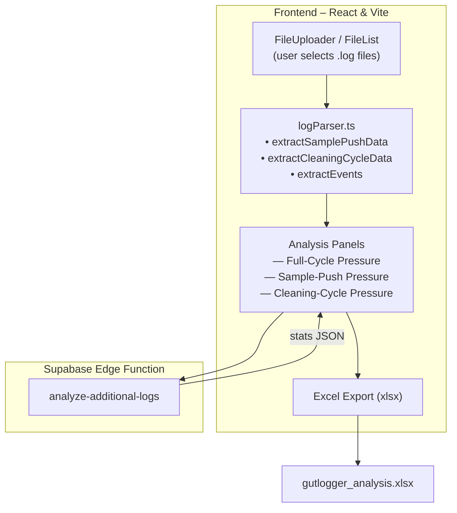

# GutLogger – Architecture Overview

The diagram shows:

1. **Frontend workflow**: users upload log files, the in-browser parser extracts relevant sections, and the data feeds various charts/panels. A single Excel export gathers all computed metrics.
2. **Edge functions** (optional): provide AI Q&A and extended statistics. These are called only when the corresponding panels need them. 